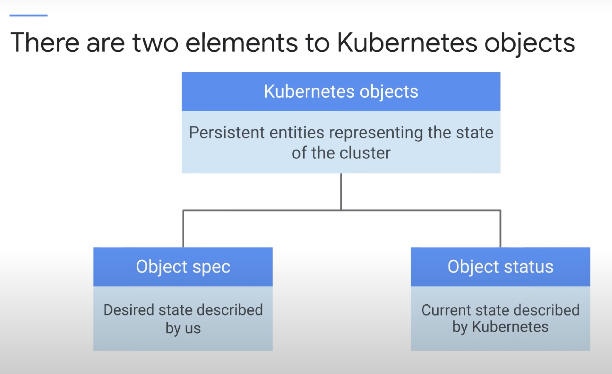
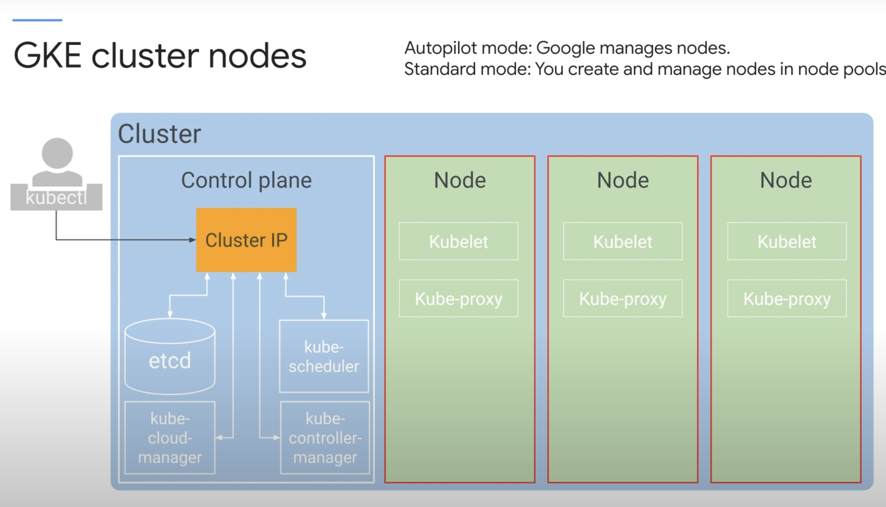
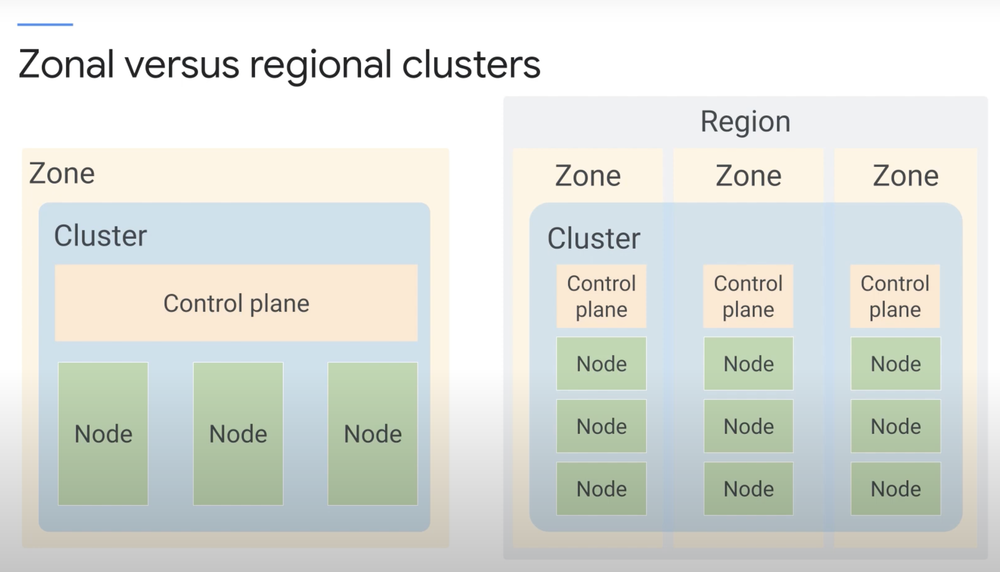
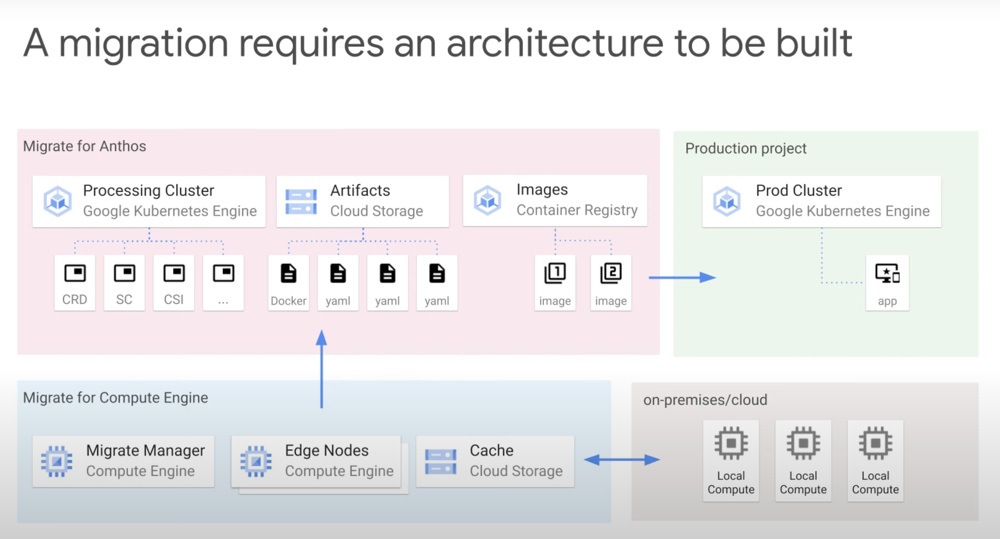
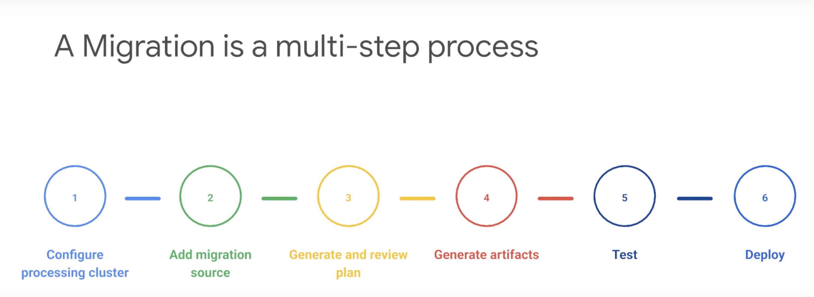

# Kubernetes Architecture

## Kubernetes Concepts
The first thing to understand about Kubernetes is the object model. Each thing Kubernetes manages is represented by an object, and you can view and change these objects, attributes, and state.

The second is the principle of declarative management. You describe the state you want to achieve, and Kubernetes will work to achieve that state.

How does Kubernetes manage the state of the cluster? It does so by using a "watch loop".

Formally, a Kubernetes object is defined as a persistent entity that represent the state of something running in the cluster:
- Desired state
- Current state
- Various objects representing containerized applications
- Resources available
- Policies for managing the cluster

Kubernetes objects have two important elements - you give Kubernetes an object spec for each object you want to create. With this spec, you define the desired state of the object by providing the characterstics that you want. On the other hand, the object status is the current state of the object provided by the Kuberentes Control Plane.



### Kinds
Each object is of a certain type, and is named "Kind".

Pods are the basic building blocks of Kubernetes. They are the smallest deployable units in Kubernetes. Every running ontainer in a Kubernetes system is a Pod. A Pod embodies the environment where containers live and that enivonrment can accommodate one or more containers.


If there's more than one container in a Pod, they aer tightly coupled and share resources, including networking and storage. Kubernetes assigns each Pod an unique IP address, and every container within a Pod shares the network namespace, including IP address and network ports. Containers within the same Pod can communicate through localhost.

A Pod can also specify a set of storage volumes to be shared amongst its containers.

> [!NOTE]
> A Pod is the smallest deployable unit in Kubernetes. Pods are NOT self-healing.

### Example
Let's suppose we asked Kubernetes to create 3 Nginx Pods, always running. Kubernetes first compares the desired state with its current state. Let's imagine its a fresh system, so the current state does not match the desired state, so Kubernetes will remedy the situation, and in this case, 3 new Pods are created. The Kubernetes Control Plane will forever watch the Pods and ensure they are running.

### Quiz
**What is the difference between a pod and a container?**
- [ ] A container contains one or more pods.
- [x] A pod contains one or more containers.
- [ ] Pods and containers are two names for the same thing.

## Kubernetes Control Plane
The Kubernetes Control Plane is the fleet of cooperating processes that make a Kubernetes cluster work. We'll build up the Kuberentes cluster part by part, explaining each piece as we go. After this is done, you'll be able to understand that the Kubernetes cluster running in GKE is a lot less work to manage compared to one you provision yourself.

First and foremost, your cluster needs computers. Nowadays, computers are usually VMs. One computer is called the **Control Plane**, while the rest are **Nodes**. The job of the nodes is to Pods. The job of the control plane is to control the cluster and manage the nodes.


### Control Plane
Several critical Kubernetes components run under the control plane. The single component that you interact with directly is called a `kube-APIserver`. This component's job is to accept commands that view or change the state of the cluster, including launching Pods.

Here, you will use the `kubectl` command line tool to interact with the API server. It's not just `kubectl` that interacts with the API server, but also the Kubernetes Dashboard, and the Kubernetes API server itself. In fact, any query or change towards the cluster state must be addressed to the `kube-APIserver`.

`etcd` is the cluster's database, a key-value store to reliably store the state of the cluster. This includes all the cluster configuration data and more dynamic information, such as what nodes are part of the cluster, what Pods should be running, and where they should be running. You'll never directly interact with `etcd`, instead `kube-APIserver` will do so on behalf of the system.

`kube-scheduler` is responsbile for scheduling Pods onto nodes. It evaluates the requirements of each Pod and selects the most suitable node for it. It doesn't do the work of actually launching the Pods on the nodes, it only chooses a Node for a Pod that isn't assigned yet. How does it decide where to run a Pod? It knows the state of all nodes and it will obey constraints that you define on where a Pod may be ran, based on hardware, software, and policy.

Ex. Pod A must be ran on a node with a certain amount of memory. Pods in Group Z prefer to run on the same Node, or vice versa.

`kube-controller-manager` continuously monitors the state of the cluster via `kube-APIserver`, and whenever the currrent state of the cluster doesn't mattch the desired state, it will attempt to make changes to achieve the desired state. It's called the controller manager because many Kubernetes objects are managed by loops of code called controllers. These loops handle the process of re-mediation.

Ex. 3 Nginx Pods are desired. We can gather them together into a controller object called a `Deployment`. This will keep them running and let us scale them and bring them together under the frontend. We'll meet `Deployments` later.

`kube-cloud-manager` manages controllers that interact with the underlying cloud providers. For example, ify you manually launched a Kubernetes cluster on Google Compute Engine, `kube-cloud-manager` would be responsible for bringing in GCP features like load balancers and storage volumes when you need them.

### Nodes
Each node runs a small set of control plane components too

Each node runs a `kubelet`, which is an agent that makes sure that the containers are running in a Pod. When the `kube-APIserver` wants to start a Pod on a node, it connects to that node's `kubelet`, which then starts the container and monitors its life cycle, before reporting back to `kube-APIserver`.

`kube-proxy` is responsible for maintaining the network rules on the node.

### Quiz
**What is the role of the kubelet?**
- [ ] To interact with underlying cloud providers
- [ ] To maintain network connectivity among the Pods in a cluster
- [x] To serve as Kubernetes's agent on each node

**Which control plane component is the cluster's database?**
- [ ] kube-scheduler
- [ ] kube-controller-manager
- [x] etcd
- [ ] kube-apiserver

**Which control plane component is the only one with which clients interact directly?**
- [x] kube-apiserver
- [ ] kube-scheduler
- [ ] etcd
- [ ] kube-controller-manager

## Google Kubernetes Engine Concepts
These are concepts specific to GKE.

Setting up a Kubernetes cluster by hand is a lot of work. Fortunately, there is an open-source command called `kubeadm` that can automate much of the initial setup of a cluster. But, if a node fails or needs maintenance, human intervention is required.

GKE is available in two modes of operation: Autopilot and Standard.

### Autopilot
Autopilot mode is a new mode of operation for GKE that manages the entire cluster's infrastructure, including control plane, node-pools, and nodes.
- Optimized Managed Kubernetes with hands-off experience
- Less management overhead, but less configuration abilities
- Only pay for what you use (Pod pricing)

Here, GCP manages all operation aspects of the cluster, ensuring that your workloads always has a place to run. It gracefully handles scaling, security, and maintenace.

### Standard
Standard mode has all of the same functionality as Autopilot, but you are responsible for the configuration, management, and optimization of the cluster to your requirements.
- Managed Kubernetes with configuration flexibility
- More management overhead but fine grained configuration
- Pay for all provisioned infrastructure, regardless of utilization

GCP advises that unless you have specific reasons that dictate the level of configuration control that standard offers, you should always use Autopilot.

### GKE Details
GKE manages all the control plane components for us. It still exposes an IP address for which we send all of our Kubernetes API requests, but GKE takes responsibility for provisioning and managing all the control plane infrastructure behind it.

For the Nodes configuration and management, it depends on the type of GKE mode that you are using.

With Autopilot mode, GKE manages the underlying infrastructure, including node configuration, auto-scaling, auto-upgrades, baseline security configurations, and baseline networking configuration.

With Standard mode, you'll have to manage all of that and more yourself.



### Nodes
In any Kubernetes environment, nodes are created externally by cluster administrators, not by Kubernetes itself. GKE will automate this process for you by launching Compute Engine VMs and registers them as Nodes. You can manage Node settings directly from GCP console.

You'll pay per hour of life of your Nodes (not counting control plane).

Because Nodes run on Compute Engine, you can choose your Node machine type and configuration, just like in Compute Engine itself.

You can select multiple Node machine types by creating multiple Node pools. A Node pool is a subset of Nodes within a cluster that share a configuration for their underlying Compute Engine VMs. Node pools also provide an easy way to ensure that workloads run on the right hardware within your cluster.

At the Node pool level, you can also enable automatic Node upgrades, Node repairs, and Node scaling.

> [!NOTE]
> Node pools are a GKE-specific concept. You can build something similar using open-source Kubernetes tools, but you'll have to maintain it manually.

> [!WARNING]
> Some of each Node's allocated resources (CPU and Memory) are reserved for the GKE and Kubernetes components that will not be available for your workloads.

By default, a cluster on GKE will launch three identical Nodes, all within the same Node pool. Of course, adding more Nodes is a trivial task, and can improve availability. However, what happens if the entire Compute Engine zone goes down?

### GKE Regional Clusters
We can address our concerns using a GKE Regional cluster. Regional clusters have a single API endpoint for the cluster, however, its control plane and Nodes are spread across multiple Compute Engine zones within a singular region.

Regional clusters ensure that the availability both your application and control plane is not affected by the failure of one or more, but not all, zones.

By default, a regional cluster is spread across three zones, and each zone having similar components to the single zone clusters we discussed earlier.

> [!NOTE]
> As this is a type of redundancy, if you have 5 Nodes in Zone 1, you'll also have 5 Nodes in Zone 2 and 5 Nodes in Zone 3.
>
> Once you've built a Zonal cluster, you cannot convert it into a Regional cluster, or vice versa.



### Private Clusters
Both Zonal and Regional clusters can be made private, which means that the control plane and Nodes are not exposed to the public internet.

Cluster control planes can be accessed through GCP products through an internal IP address. They can also be accessed by authorized networks through an external IP address.

Nodes can ave limited outbound access through Private Google Access, which allows them to communicate with other GCP services, such as pulling images from Container Registry without the need of an external IP address.

### Quiz
**What is the purpose of configuring a regional cluster in GKE?**
- [x] To allow applications running in the cluster to withstand the loss of a zone
- [ ] To ensure that the cluster's workloads are isolated from the public Internet

**In GKE, how are control planes provisioned?**
- [ ] As abstract parts of the GKE service that are not exposed to Google Cloud customers
- [x] As Compute Engine virtual machines

**In GKE clusters, how are nodes provisioned?**
- [x] As Compute Engine virtual machines
- [ ] As abstract parts of the GKE service that are not exposed to Google Cloud customers

## Kubernetes Object Management
All Kubernetes objects are identified by an unique name and an unique identifier.

Let's return to our 3 Nginx Pods example. The simplest way is to declare three Pod objects and specify their state: a Pod must be created and an Nginx container image must be used. Let's see how we declare this:

```yaml
apiVersion: apps/v1
kind: Pod
metadata:
    name: nginx
    labels:
        app: nginx
spec:
    containes:
        - name: nginx
          image: nginx:latest
```

You define the objects the objects you want Kubernetes to create and maintain with manifest files, either in YAML or JSON.

The example above has the required fields for a manifest file:
- `apiVersion`: The version of the Kubernetes API that you are using.
- `kind`: The type of object you want to create.
- `metadata`: Helps identify the object using name, unique ID, and optional namespace
- `spec`: What the object are made of

### Metadata
When you create a Kubernetes object, you name it with a string.

> [!NOTE]
> Names are unique within the same particular Kind and Namespace.

Each object generated through the life of a cluster has an unique ID, generated by Kubernetes.

Labels are key-value pairs for which you tag your objects during or after their creation, and can help you identify and organize objects and subsets of objects.

```yaml
apiVersion: apps/v1
kind: Pod
metadata:
    name: nginx
    labels:
        app: nginx
        env: dev
        stack: frontend
spec:
    containes:
        - name: nginx
          image: nginx:latest
```

Various contexts offer ways to select Kubernetes resources by their labels, particularly with `kubectl`.

```bash
kubectl get pods --selector=app=nginx
```

### Controller Objects
So, one way to bring up three Nginx Pods is to create three Pod objects, each with their own manifest file. This isn't scalable, since managing 200 manifest files sounds inconvenient. Another problem is that Pods don't heal or repair themselves, and they're not meant to run forever. They are designed to be ephemeral and disposable. For this reason, there are better ways to manage your Kubernetes objects.

So, how do you tell Kubernetes to create and maintain your 3 Nginx containers? We can use different controllers, such as:
- Deployments
- StatefulSets
- DaemonSets
- Jobs

#### Deployment
Deployments are a great choice for long-lived software components like web servers, especially when we want to manage them as a group. For example, if we schedule Pods for a Deployment, the Deployment controller will monitor and maintain our Pods. If one of those Pods fail, the Deployment controller will recognize the difference between desired and current state,and remedy the situation.

Instead of using multiple YAML manifests, you can use a single Deployment manifest file to launch three replicas of the same container. A Deployment ensures that a defined set of Pods is running at any given time. Within its object spec, you can specify the number of replicas, how Pods should run, which containers should run within these Pods, which Volumes should be mounted, and more.

```yaml
apiVersion: apps/v1
kind: Deployment
metadata:
    name: nginx-deployment
    labels:
        app: nginx
spec:
    replicas: 3
    template:
        metadata:
            labels:
                app: nginx
        spec:
            containers:
                - name: nginx
                  image: nginx:latest
```

Deployments can also do a lot more than this, but this is its basic form.

### Resource Management
It's important to have enough resources for your Pods to run. It is very possible that if you schedule a large application on a Node with limited resources that the application will fail or not run at all.

It is also very possible that applications can take up more resources than you expect they should. Regardless of the cause, Kubernetes has a way to manage resources.

When you specify a Pod, you can optionally specify how much of each resource a container needs, such as CPU and memory.

Let's take a look at the mechanism for which Kubernetes manages resources.

Kubernetes lets you abstract a single physical cluster into multiple clusters known as **namespaces**. Namespaces provide scope for naming resources such as Pods, Deployments and controllers, and allow you to implement resource quotas across the cluster. These quotas define limits for resource consumption within a Namespace. These are not the same as your GCP quotas, as they only apply to the Kubernetes cluster they're defined on.

There are three default Namespaces in any given cluster:
- `default`: The default Namespace for objects that don't specify a Namespace.
- `kube-system`: The Namespace for objects created by the Kubernetes system.
- `kube-public`: The Namespace for objects that are publicly accessible.

You can specify a Namespace for an object in its manifest file. If you don't specify a Namespace, the object will be created in the `default` Namespace. You can also do so at the command line level using `kubectl`.

GCP suggests to use Namespaces at the CLI level to make your manifest files more flexible.

> [!NOTE]
> When you use the `kubectl` command, `kube-system` is excluded by default, but you can choose to view it explicitly.

### Quiz
**What are Kubernetes namespaces useful for? Choose all that are correct (2 correct answers).**
- [x] Namespaces allow you to use object names that would otherwise be duplicates of one another.
- [x] Namespaces partition Linux kernel resources.
- [ ] Namespaces make resources more secure,
- [ ] Namespaces let you implement resource quotas across your cluster.


**In a manifest file for a Pod, in which field do you define a container image for the Pod?**
- [x] spec
- [ ] kind
- [ ] metadata
- [ ] apiVersion

**What is the purpose of the Deployment object?**
- [x] To ensure that a defined set of Pods is running at any given time.
- [ ] To launch one or more Pods on a time-based schedule.
- [ ] To launch one or more Pods and ensure that a specified number of them successfully run to completion and exit.

> [!NOTE]
> **Deployment and ReplicaSet Objects**
> The example Nginx deployment in this section was simplified. In practice, you would launch a Deployment object to manage your desired three Nginx Pods, just as the video described. However, the Deployment object would create a ReplicaSet object to manage the Pods.
>
> You will work with Deployment objects directly much more often than ReplicaSet objects, but its still helpful to know about them. For example, one capability of a Deployment is to allow a rolling upgrade of the Pods it manages. To perform the upgrade, the Deployment object will create a second ReplicaSet object, and then increase the number of (upgraded) Pods in the second ReplicaSet while it decreases the number in the first ReplicaSet.


> [!NOTE]
> **A Note about Services**
> Services provide load-balanced access to specific Pods. There are three primary types of services:
> - ClusterIP: Exposes the service on an IP address that is only accessible within the cluster. (Default)
> - NodePort: Exposes the service on the IP address of each Node in the cluster, at a specific port.
> - LoadBalancer: Exposes the service externally using a GCP Load Balancer.
>
> In GKE, LoadBalancers give you access to a regional Network Load Balancing configuration by default. To get access to a global HTTP(S) Load Balancing configuration, you can use an Ingress object.

> [!NOTE]
> **Controller objects to know about**
> To note, there are several controller objects that you should be aware of:
> - Deployments
> - ReplicaSets
> - Replication Controllers
> - StatefulSets
> - DaemonSets
> - Jobs
>
> A ReplicaSet controller ensures that a population of Pods, all identical, are running at the same time. Deployments let you do declarative updates to ReplicaSets and Pods. Under the hood, a Deployment will create a ReplicaSet, so you'll rarely need to interact with ReplicaSets directly.
>
> Deployments let you create, update, roll back, and scale Pods, using ReplicaSets as needed to do so.
>
> Replication Controllers perform a similar role to the combination of ReplicaSet and Deployment, **but their use is no longer recommended**.
>
> If you need to deploy applications that maintain local state, StatefulSet is a better option. It is similar to a Deployment in that the Pods use the same container spec. The Pods created through Deployment are not given persistent identities, but StatefulSet Pods are given persistent identities with stable network identities and persistent disk storage.
>
> If you need to run certain Pods on all the Nodes in your cluster or on a selection of Nodes, you can use a DaemonSet. DaemonSet ensures that a specific Pod is always running on all or some subset of Nodes. If new Nodes are added to the cluster, DaemonSet will deploy the Pod to the new Node. Kubernetes might use DaemonSet to ensure that logging agents like `fluentd` are running on all Nodes.
>
> Finally, the Job controller is used to create one or more Pods required to run a task. When the task is completed, Job will terminate those Pods. A related controller is the CronJob, which allows you to schedule Jobs.

### Quiz
**What is the purpose of a Service? Choose all that are true (2 correct answers)**
- [x] To provide a load-balancing network endpoint for Pods
- [ ] To allow you to put constraints on Pods' resource consumption
- [ ] To provide a way to inspect and diagnose code running in a Pod
- [x] To allow you to choose how Pods are exposed

**If you are deploying applications in your Pods that need persistent storage, which controller type should you use?**
- [ ] ReplicaSet
- [ ] Deployment
- [ ] DaemonSet
- [x] StatefulSet

## Migrate for Anthos
What if you have applications that you want to run on Kubernetes, but they're not in containers, or perhaps not even on the cloud? GCP offers a solution for this with Migrate for Anthos.

Migrate for Anthos is an automated process to move your existing applications into a Kubernetes environmet.

### Architecture
The first step is to allow Migrate for Compute Engine to create a pipeline for streaming or migrating the data from on-premise or another cloud provider into GCP.

Migrate for Compute Engine is a tool that allows you to bring your existing applications into VMs on GCP.

Migrate for Anthos is then installed on a GKE cluster and is composed of many Kubernetes resources. It is used to generate deployment artifacts, like configuration and Dockerfiles. The containers go into Cloud Storage, and images are stored in Container Registry.

After the deployment assets are created, tehy can be used to deploy your application into a target cluster. You simply apply the generated configuration and it creates all the necessary Kubernetes elements on the target cluster.



### Migration Path
Now that you've seen the architecture required for a migration, let's look at what happens when you migrate applications using Migrate for Anthos.



First, you'll need to create the processing cluster and install the Migrate for Anthos agent.

Next, you'll need to add the migration source to the processing cluster. This can be VMWare, AWS, Azure, or GCP. You'll need to create a migration object with the details of the migration you're performing. This will generate a plan template for you in YAML. You may need to alter this configuration file depending on your needs.

When the plan is ready, you'll need to generate the artifacts for the migration itself. This means the images, the containers, and the YAML configuration files needed for the deployment.

After your migration artifacts have been generated, they will need to be tested. Both the container images and the deployments will be tested at this stage.

Finally, if the tests are successful, you can use the generated artifacts to deploy your applications to your production clusters.

## Summary Quiz
**You need to ensure that the production applications running on your Kubernetes cluster are not impacted by test and staging deployments. Which features should you implement and configure to ensure that the resources for your production applications can be prioritized?**
- [ ] Configure Namespaces for Test, Staging and Production and configure specific Kubernetes resource quotas for the Production Namespace.
- [ ] Configure resource requests for Test, Staging and Production and configure specific Kubernetes resource quotas for the Production Namespace.
- [x] Configure Namespaces for Test, Staging and Production and configure specific Kubernetes resource quotas for the test and staging Namespaces.
- [ ] Configure labels for Test, Staging and Production and configure specific Kubernetes resource quotas for the Production Namespace.

**You want to deploy multiple copies of your application, so that you can load balance traffic across them. How should you deploy this application's Pods to the production Namespace in your cluster?**
- [x] Create a Deployment manifest that specifies the number of replicas that you want to run.
- [ ] Create a Service manifest for the LoadBalancer that specifies the number of replicas you want to run.
- [ ] Deploy the Pod manifest multiple times until you have achieved the number of replicas required.
- [ ] Create separate named Pod manifests for each instance of the application and deploy as many as you need.

**When configuring storage for stateful applications, what steps must you take to provide file system storage inside your containers for data from your applications that will not be lost or deleted if your Pods fail or are deleted for any reason?**
- [ ] You must mount NFS Volumes on each container in the Pod that requires durable storage.
- [ ] You must create Volumes using local Storage on the Nodes and mount the Volumes inside your containers to provide durable storage.
- [x] You must create Volumes using network based storage to provide durable storage remote to the Pods and specify these in the Pods.
- [ ] You must export the data from your applications to a remote service that preserves your data.

**You have deployed a new Google Kubernetes Engine regional cluster with four machines in the default pool for the first zone and left the number of zones at the default. How many Compute Engine machines are deployed and billed against your account?**
- [ ] Ten. (Four nodes are deployed in the first zone and three nodes are deployed in two other zones because you selected the defaults.)
- [x] Twelve. (Four nodes are deployed in each of three zones. A control plane node is deployed in each zone which is indirectly billed against your account through the cluster management fee.)
- [ ] Fifteen. (Four nodes and a single control plane are deployed to each of the three zones. A control plane node is deployed in each zone and it is billed against your account.)
- [ ] Sixteen. (Four nodes are deployed in primary and secondary zones in two regions, for a total of 4 zones and 16 nodes. A control plane node is deployed in each zone but it is not billed to your account.)

**Which Kubernetes component does the kubectl command connect to in order to carry out operations on a cluster?**
- [ ] kube-controller-manager
- [x] kube-apiserver
- [ ] kube-scheduler
- [ ] kube-dns

**You are designing an application, and you want to ensure that the containers are located as close to each other as possible, in order to minimize latency. Which design decision helps meet this requirement?**
- [ ] Place the containers in the same cluster.
- [ ] Give the containers the same labels.
- [ ] Place the containers in the same Namespace.
- [x] Place the containers in the same Pod.
